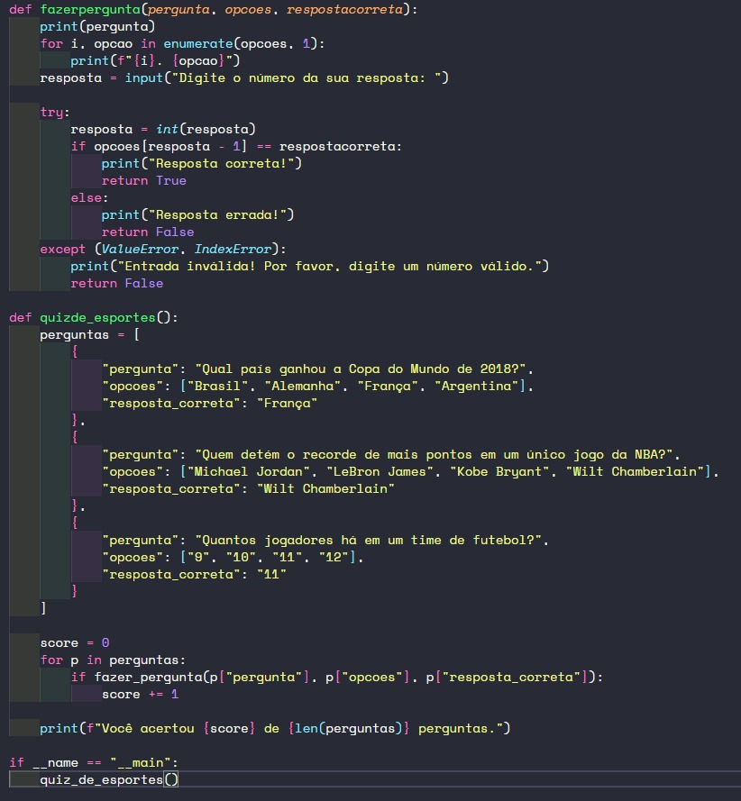
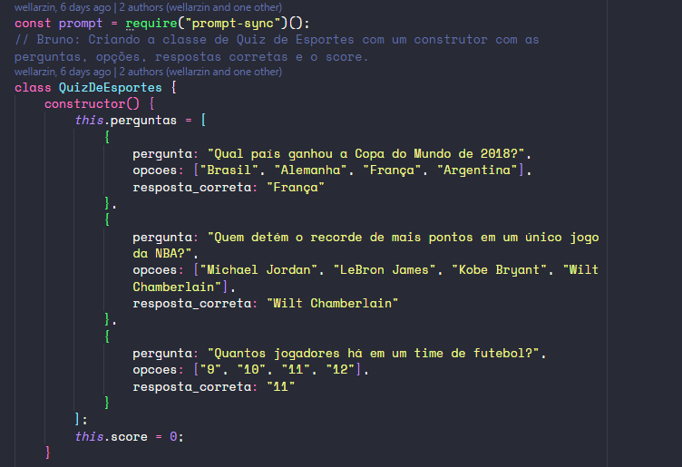
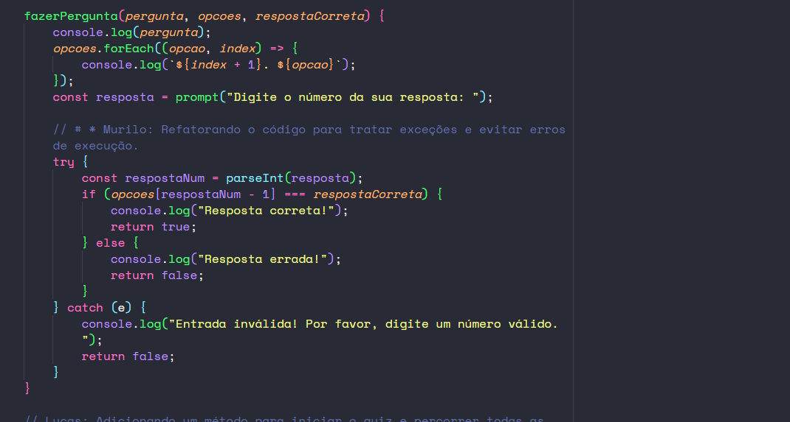
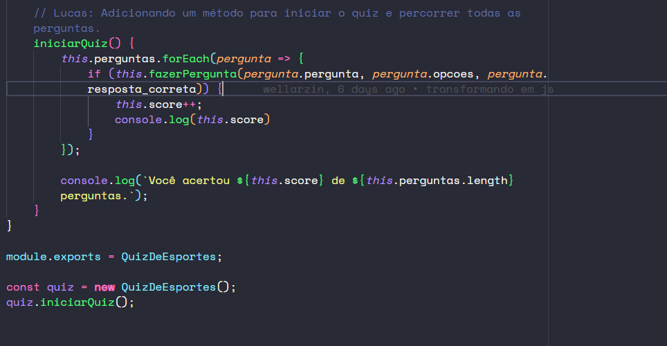
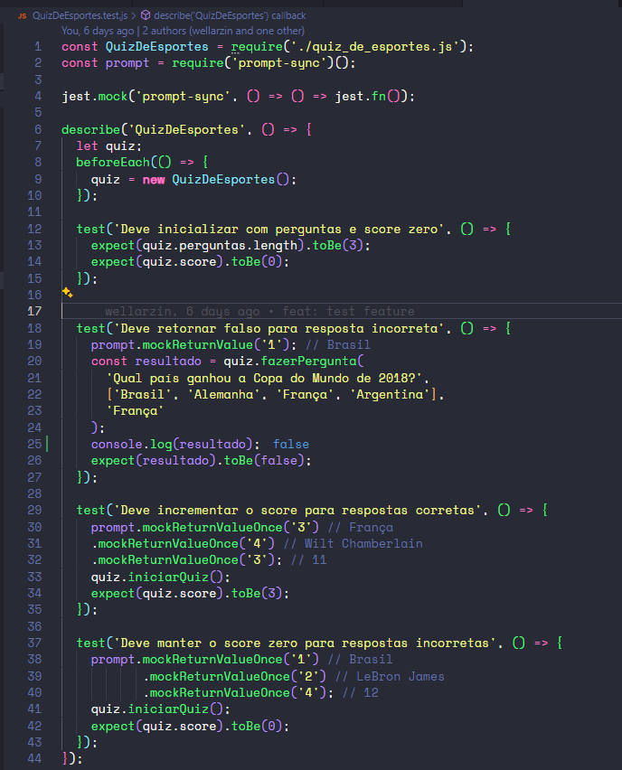

# Prints dos códigos sujos e posteriormente refatorados;
## Código sujo


## Código refatorado 1

## Código refatorado 2

## Código refatorado 3


# Descrição da ferramenta de testes utilizada;
 Foi utilizado o Jest para realizar os testes unitários da aplicação.

# Forma de configuração e instalação;
````bash
npm i
````
# Forma de execução;
````bash
node quiz_de_esportes.js
````

# Prints dos testes realizados;

